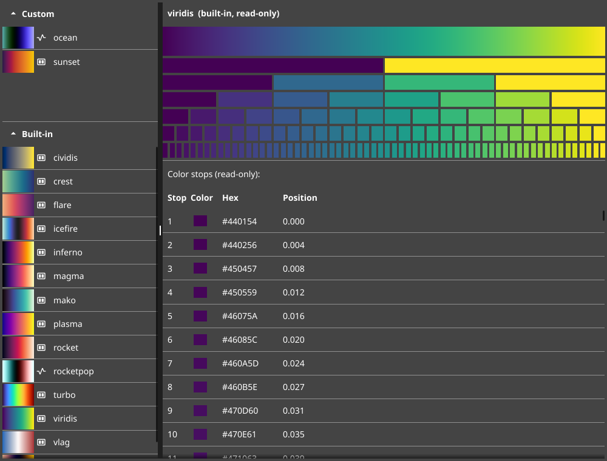
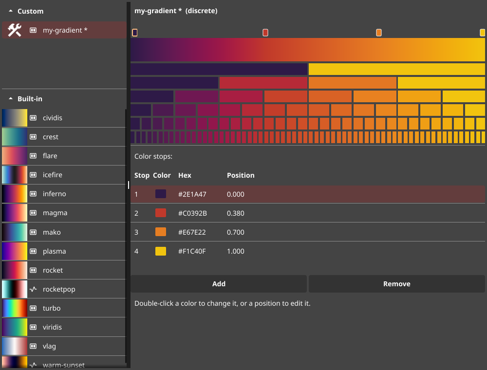
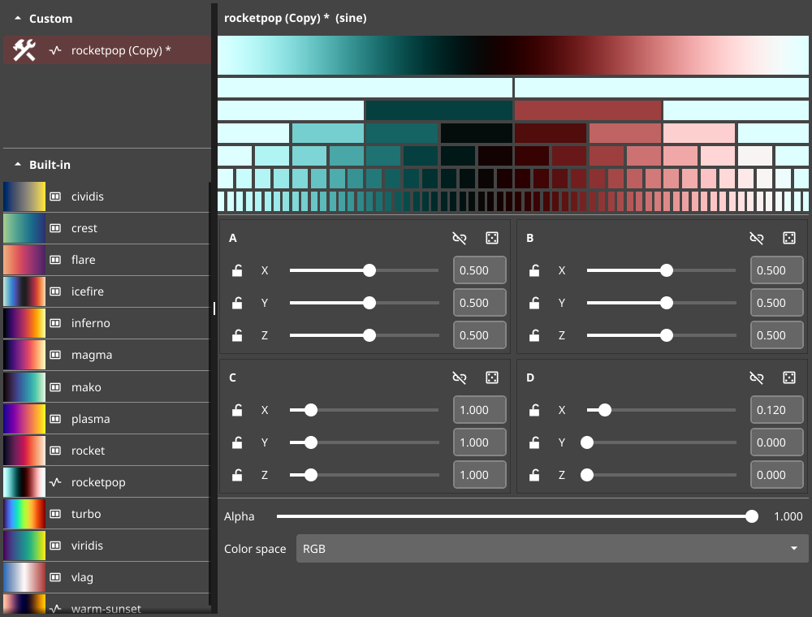

# palettedb

A desktop app and Go library for creating, browsing, exporting, and reusing
color palettes built on [gaul](https://github.com/aldernero/gaul). Palettes are
stored in a local SQLite database, and a set of well-known data-visualization
colormaps ship built in.



## Features

- **Two kinds of palette** — hand-placed **discrete** gradients and parametric
  **sine** palettes (see below).
- **Built-in colormaps** — viridis, plasma, inferno, magma, cividis, turbo,
  mako, rocket, flare, crest, vlag, icefire, and a couple of project sine
  palettes — always available, read-only, and searchable by name.
- **Live previews** — every palette shows a continuous gradient strip and rows
  of discrete swatches.
- **Export** — write any palette to a GIMP palette (`.gpl`) or CSV with a
  configurable number of colors.
- **Familiar editing** — new palettes appear immediately as "Untitled" drafts
  with a `*` modified marker; save writes them to the database; right-click a
  palette to copy, rename, or delete it. Light / Dark / System theming.
- **Library API** — fetch palettes by name from your own Go programs.

## The two palette types

### Discrete palettes

A discrete palette is a list of color **stops**, each at an adjustable position
in `[0, 1]`. Colors between stops are interpolated (in HCL). Drag the ticks on
the gradient to move stops, or edit the color/position directly in the table.



### Sine palettes

A sine (cosine-gradient) palette is defined by four `RGB` coefficient vectors
**A, B, C, D** where the color at position `t` is

```
color(t) = A + B * cos(2π * (C * t + D))
```

This produces smooth, endlessly-cyclable gradients from just a few numbers. Lock
axes to move them together, roll the dice to explore, or type exact values.



## Install / run

Requires Go 1.26+.

```sh
go run github.com/aldernero/palettedb/cmd/palettedb@latest
```

or from a clone:

```sh
go build ./cmd/palettedb && ./palettedb
# or: make build
```

On Linux, the default build runs through XWayland. For a native-Wayland build
(better multi-monitor HiDPI handling) install the dev headers
(`wayland-devel libxkbcommon-devel libdecor-devel wayland-protocols-devel` on
Fedora) and build with the `wayland` tag:

```sh
go run -tags wayland ./cmd/palettedb
```

The database lives at `~/.config/palettedb/palettedb.db` (XDG). It is created on
first run; built-in palettes work even with no database.

## Using palettes from code

`palettedb` is also importable as a library. By-name lookups search your saved
palettes first, then the built-ins — so `viridis`, `turbo`, `warm-sunset`, etc.
resolve even against an empty (or missing) database.

```go
package main

import (
	"fmt"
	"log"

	"github.com/aldernero/palettedb"
)

func main() {
	// Opens ~/.config/palettedb/palettedb.db (or use palettedb.Open(path)).
	db, err := palettedb.OpenDefault()
	if err != nil {
		log.Fatal(err)
	}
	defer db.Close()

	// A discrete palette (built-in) as a gaul.Gradient.
	grad, err := db.LoadDiscreteByName("viridis")
	if err != nil {
		log.Fatal(err)
	}

	// Sample 8 evenly-spaced colors.
	for i := 0; i < 8; i++ {
		r, g, b, _ := grad.ColorAtStop(i, 8).RGBA()
		fmt.Printf("%d: #%02X%02X%02X\n", i, uint8(r>>8), uint8(g>>8), uint8(b>>8))
	}

	// A sine palette by name.
	sp, err := db.LoadSineByName("warm-sunset")
	if err != nil {
		log.Fatal(err)
	}
	mid := sp.ColorAt(0.5) // color at the midpoint
	fmt.Println(mid)
}
```

Both `gaul.Gradient` and `gaul.SinePalette` satisfy the `gaul.Palette`
interface:

```go
type Palette interface {
	ColorAt(t float64) color.Color    // t in [0,1]
	ColorAtStop(i, n int) color.Color // stop i of n (t = i/(n-1))
}
```

If you don't know the type ahead of time, use `PaletteByName`, which returns a
`gaul.Palette` plus its kind:

```go
p, kind, err := db.PaletteByName("turbo") // kind == "discrete"
if err != nil {
	log.Fatal(err)
}
c := p.ColorAt(0.42)
```

## Development

```sh
make test   # go test ./...
make lint   # golangci-lint (v2), default and -tags wayland
make all    # vet + lint + test
```

## Attribution & license

palettedb is licensed under the [Apache License 2.0](LICENSE).

The built-in colormaps are third-party data used under their own licenses (CC0,
Apache-2.0, and BSD-3-Clause) — see
[`internal/builtins/THIRD_PARTY_NOTICES.md`](internal/builtins/THIRD_PARTY_NOTICES.md).
UI icons are from [Google Material Symbols](https://fonts.google.com/icons)
(Apache-2.0) — see
[`ui/resources/THIRD_PARTY_NOTICES.md`](ui/resources/THIRD_PARTY_NOTICES.md).
